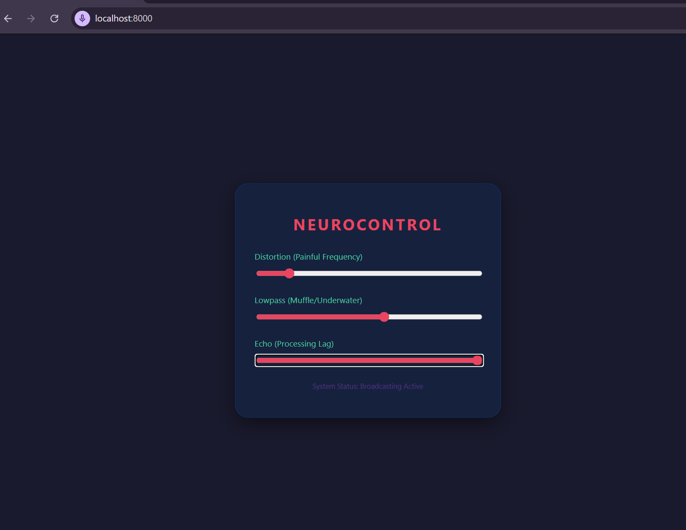
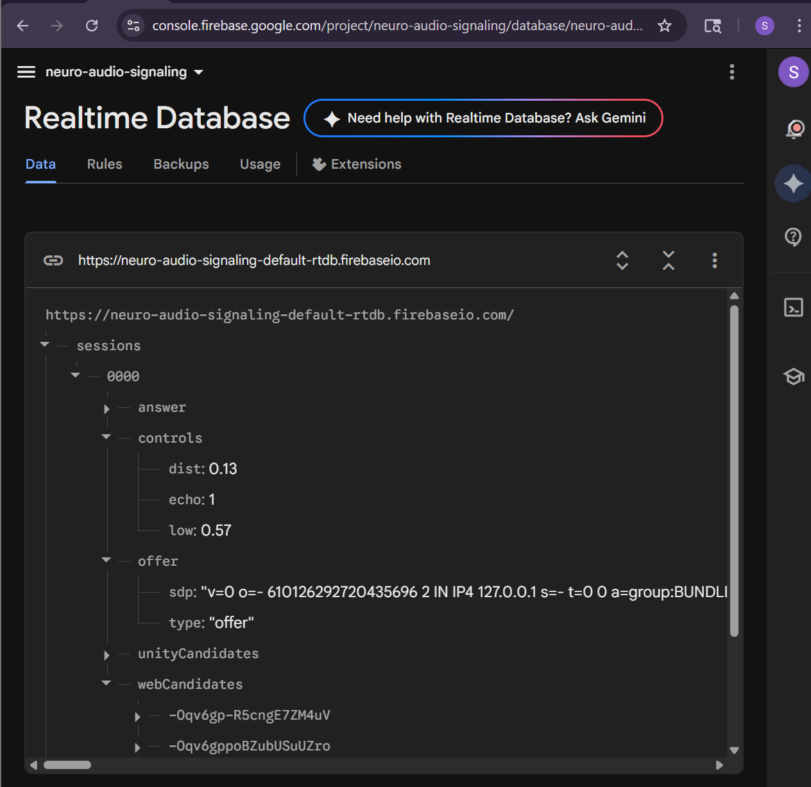
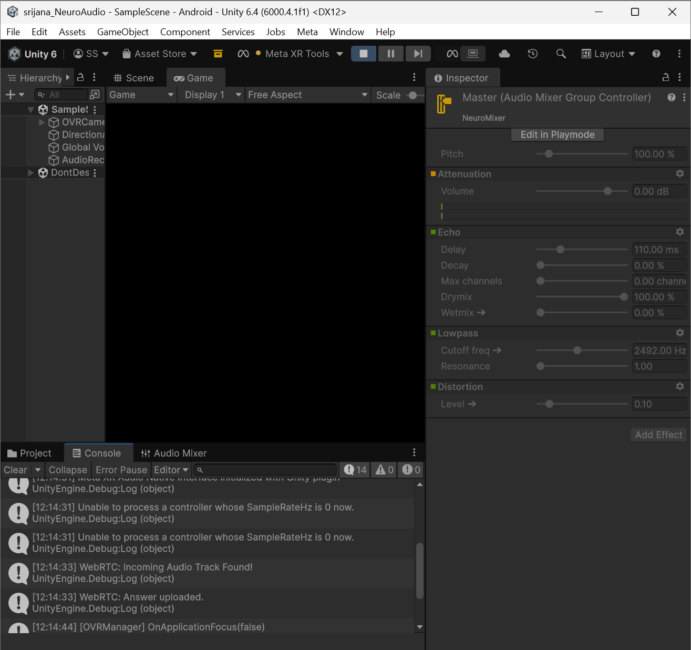

# XR Sensory Simulation Framework  
### (Srijana NeuroAudio – VR Audio Environment)

A distributed Extended Reality (XR) system for real-time auditory regulation using Meta Quest 3. This project enables dynamic audio filtering through a WebRTC-based streaming pipeline, designed to simulate adaptive sensory environments for workplace accessibility.

---

## 📸 Visual Documentation

### Facilitator Dashboard (NeuroControl)
The web interface allows real-time manipulation of the auditory environment using WebRTC. This dashboard sends control signals directly to the Unity environment via Firebase.

### Firebase Real-Time Synchronization
Data is synchronized across the Web, Firebase, and Unity pipelines with sub-100ms latency. This ensures that environmental changes are felt by the VR user instantly.

### Unity Signal Processing
Unity receives the WebRTC audio track and applies dynamic filters (Lowpass, Echo, Distortion) based on the data received from the dashboard. The console log confirms a successful "Incoming Audio Track Found!" handshake.

---

## 📌 Overview  
The XR Sensory Simulation Framework is built to help manage sensory overload by allowing real-time control over environmental audio. Unlike static solutions, this system provides **live, adjustable audio modulation** while preserving situational awareness through passthrough XR.

The system uses a **distributed architecture**, offloading processing across a Python engine, Firebase cloud layer, and Unity XR application to maintain performance and low latency.

---

## 🚀 Features  

- 🎧 **Live WebRTC Audio Streaming** Stream real-time audio from a web dashboard to Meta Quest 3  

- 🎚️ **Dynamic Audio Filters** - Low-pass filtering (Muffle control)  
  - Echo / delay modulation  
  - Real-time parameter tuning  

- 🌐 **Firebase-Based Signaling** Enables peer-to-peer communication and synchronization  

- ⚡ **Low Latency System** Sub-100 ms response time for real-time control  

- 👁️ **Passthrough Integration** Maintains real-world awareness while applying audio effects  

---

## 🏗️ System Architecture  

The framework follows a **three-layer distributed model**:

### 1. Audio Capture & Streaming Layer (Python / WebRTC)
- Captures microphone input from the host system  
- Streams audio via WebRTC to the XR device  
- Handles preprocessing and encoding  

### 2. Cloud Signaling Layer (Firebase)
- Uses Firebase Realtime Database for signaling  
- Manages session data (`sessions/0000/effects/`)  
- Synchronizes filter parameters in real time  

### 3. XR Processing Layer (Unity – Meta Quest 3)
- Receives audio stream  
- Applies DSP filters using Unity Audio Mixer  
- Renders passthrough environment using URP  

---

## ⚙️ Technical Stack  

- **XR Device:** Meta Quest 3  
- **Engine:** Unity 6 (URP)  
- **Programming Languages:** C#, Python  
- **Streaming:** WebRTC  
- **Backend / Signaling:** Firebase Realtime Database  
- **Audio Processing:** Unity DSP + Audio Mixer  

---

## 🎛️ Audio Processing Pipeline  

The system uses a **real-time DSP pipeline** inside Unity:

- **Lowpass Filter (`LowpassFreq`)** Reduces high-frequency noise to simulate “muffle”  

- **Echo / Delay (`EchoLevel`)** Adds spatial softness to audio signals  

- **Dynamic Parameter Control** Updated via Firebase in real time  

---

## 📊 Performance  

- ✅ Stable **72 FPS** on Meta Quest 3  
- ⚡ **<100 ms latency** for parameter updates  
- 🔋 Reduced thermal load via distributed processing  
- 📡 Reliable real-time audio streaming  

---

## 📁 Technical Configuration  

- **Unity Version:** 6000.4.1f1  
- **Audio System:** Unity Audio Mixer (Exposed Parameters)  
- **Firebase Path:** `sessions/0000/effects/`  
- **Networking:** WebRTC + Firebase signaling  

---

## 🚀 How to Run  

### 1. Start Signaling Server  
Open:
http://localhost:8000  

### 2. Launch XR Application  
Build and run the Unity app on Meta Quest 3.  
Ensure the headset and laptop are on the same Wi-Fi network.  

### 3. Connect and Stream  
WebRTC establishes connection via Firebase.  
Audio begins streaming to the XR device.  

### 4. Adjust Audio Effects  
Use the web dashboard sliders.  
Updates are written to:  
`sessions/0000/effects/`  

---

## ⚠️ Important Notes  

- 🎧 **Use Headphones (Required)** Prevents audio feedback loops during streaming  

- 🎤 **Microphone Permissions** Must be enabled in Android Manifest for Quest  

- 🌐 **Network Requirement** Both devices must be on the same local network  

---

## 🎯 Use Case  

This system is designed to support:  

- Neurodivergent workplace accessibility  
- Sensory regulation in dynamic environments  
- Real-time adaptive audio experiences  

---

## 🙌 Acknowledgments  

- Algoma University  
- The Chance Centre, Brampton  

---

## 📄 License  

This project is licensed under the MIT License.  

---

## 👩‍💻 Author  

**Srijana Shrestha** Algoma University  
📧 srshrestha@algomau.ca
